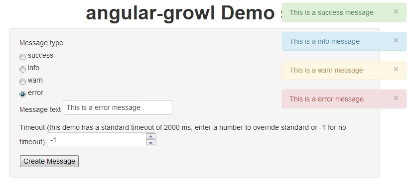

#angular-growl

> growl like notifications for angularJS projects, using bootstrap alert classes

##Features



##Installation

You can install angular-growl with bower:

> bower install angular-growl

Alternatively you can download the file [build/angular-growl.js](build/angular-growl.js) manually and include it in your project.

As angular-growl is based on its own angularJS module, you have to alter your dependency list when creating your application
module:

````javascript
    ...
    var app = angular.module('myApp', ['angular-growl']);
    ...
````

Finally, you have to include the directive somewhere in your HTML like this:

````html
    <body>
        ...
        <div growl></div>
        ...
    </body>
````

##Configuration

Standard behaviour is, that all notifications need to be closed manually by the user.

However, you can configure a global timeout (TTL) after which notifications should be automatically closed.  To do
this, you have to configure this during config phase of angular bootstrap like this:

````javascript
    ...
    var app = angular.module('myApp', ['angular-growl']);

    app.config(['growlProvider', function(growlProvider) {
        growlProvider.globalTimeToLive(5000);
    }]);
````

This sets a global timeout of 5 seconds after which every notification will be closed.

You can override TTL generally for every single message if you want:

````javascript
    app.controller("demoCtrl", ['$scope', 'growl', function($scope, growl) {
        $scope.addSpecialWarnMessage = function() {
            growl.addWarnMessage("Override global ttl setting", {ttl: 10000});
        }
    }]);
````

This sets a 10 second timeout, after which the notification will be automatically closed.

If you have set a global TTL, you can disable automatic closing of single notifications by setting their ttl to -1:

````javascript
    app.controller("demoCtrl", ['$scope', 'growl', function($scope, growl) {
        $scope.addSpecialWarnMessage = function() {
            growl.addWarnMessage("this will not be closed automatically even when a global ttl is set", {ttl: -1});
        }
    }]);
````
